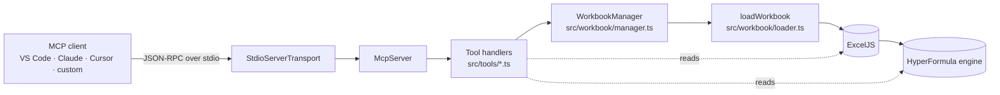

# Architecture

## Data flow

## Why two libraries?

**HyperFormula** is a headless spreadsheet engine — it evaluates formulas, but it cannot open `.xlsx` files (they are ZIP archives of XML that only Excel-focused parsers understand). **ExcelJS** does the opposite: it parses `.xlsx` beautifully but does not calculate anything, so cached formula results in the file can be stale or missing.

Combining them gives us the best of both:

1. **Parse** — ExcelJS reads the file and gives us a rich object model: raw values, formula strings, rich text, hyperlinks, number formats, dates.
2. **Normalize** — `loader.ts` walks every cell, keeping formulas as `=…` strings, flattening rich text, converting `Date` objects to Excel serial numbers, and passing everything else through unchanged.
3. **Evaluate** — the normalized grid is fed to `HyperFormula.buildFromSheets(...)`. HyperFormula recomputes every formula, resolves cross-sheet references and named expressions, and becomes the source of truth for evaluated values.
4. **Serve** — MCP tools read from HyperFormula (values, formulas, dimensions) and, when we want formatting details, fall back to the ExcelJS model.

## Session model

MCP sessions are stateful. Each `open_workbook` call returns a `workbookId` handle that the client passes to subsequent tools. The `WorkbookManager` holds the loaded `LoadedWorkbook` objects (ExcelJS workbook + HyperFormula instance + metadata) in a `Map`, subject to configurable `maxWorkbooks` and `maxFileBytes` limits.

`close_workbook` and the SIGINT/SIGTERM handlers call `HyperFormula.destroy()` to release engine memory. Because Node's garbage collector cannot see into HyperFormula's native buffers, explicit `destroy()` is important for long-running sessions.

## Cell address conventions

- **Public API (input/output)**: A1 notation. Cells like `"B7"`, ranges like `"A1:D50"`.
- **Internal (HyperFormula)**: `{ sheet, row, col }` with **0-based** row/col.
- Conversion helpers live in `src/util/cell-address.ts`.

## Error model

Every tool wraps its handler in `try/catch` and returns a structured MCP error via `_helpers.ts::fail`. Errors of type `ExcelMcpError` (in `src/util/errors.ts`) carry a machine-readable `code` (e.g. `WORKBOOK_NOT_FOUND`, `SHEET_NOT_FOUND`, `INVALID_RANGE`, `FILE_TOO_LARGE`) so clients can react programmatically. The structured payload is duplicated in `content[0].text` for clients that only understand text content.

## Safety posture

- **Read-only.** No tools mutate the workbook or write files.
- **Path safety.** `EXCEL_MCP_ALLOWED_ROOTS` restricts the filesystem area the server will open. Without it, any file the user's Node process can read is fair game — this is the same trust boundary as the MCP client itself.
- **Size caps.** `EXCEL_MCP_MAX_FILE_MB` bounds file size and `MAX_CELLS_PER_SHEET` (5,000,000) bounds per-sheet cell count to prevent DoS-by-huge-file.
- **No network I/O** and **no shell exec** anywhere in the server.
- **Stderr for logs.** stdout is reserved for MCP framing on the stdio transport.

## Extending the server

Adding a tool is three steps:

1. Create `src/tools/my-tool.ts` exporting `registerMyTool(server, manager)`.
2. Call `server.registerTool(name, config, handler)` inside it. Use `ok(payload)` / `fail(err)` from `_helpers.ts` for consistent responses.
3. Import and call the register function in `src/tools/index.ts`.

Add a unit test in `tests/tools.test.ts` using the in-memory MCP transport.
